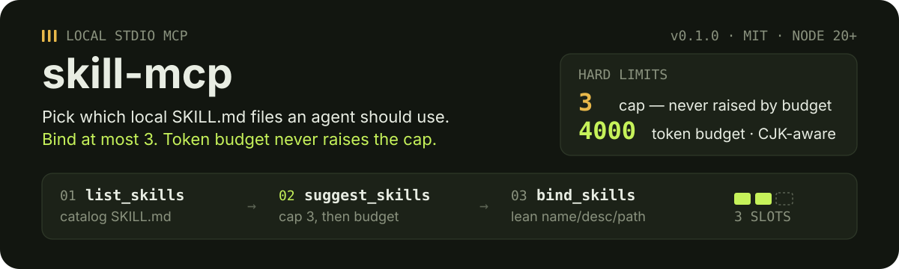
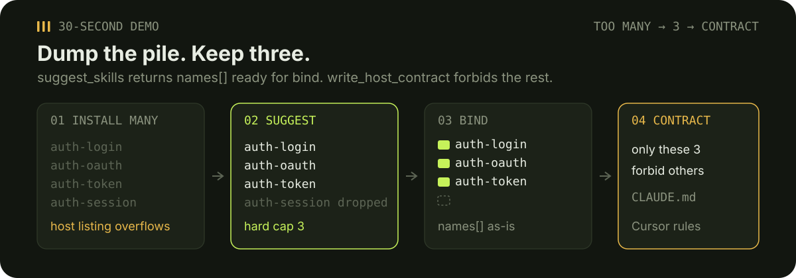
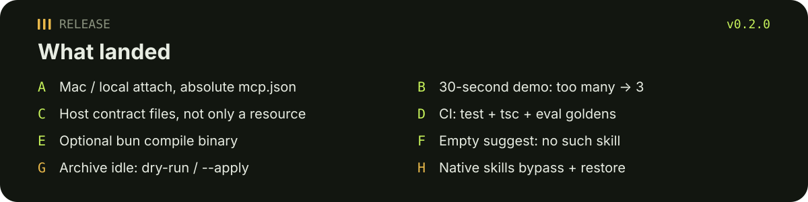
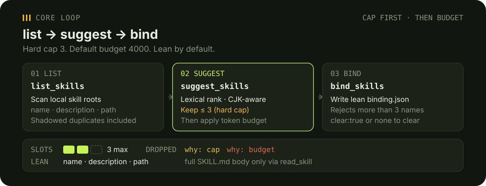
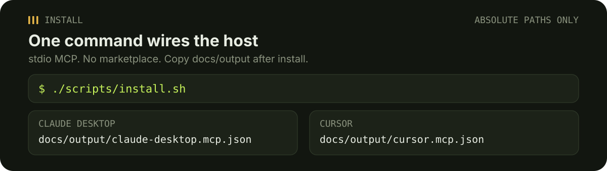
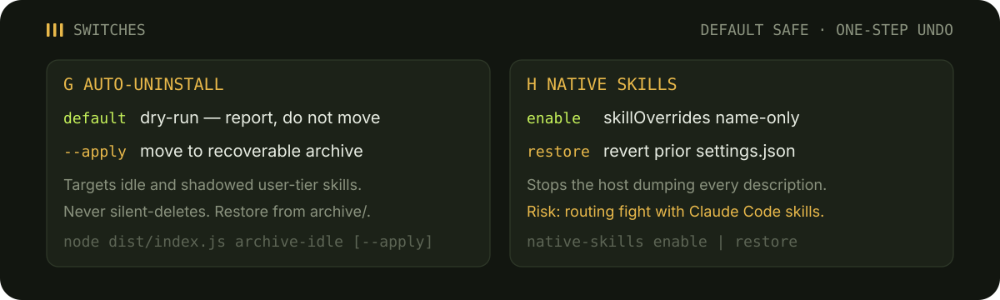

# skill-mcp

<p align="center">
  
</p>

<p align="center"><a href="./README.zh-CN.md">中文</a> · <a href="https://github.com/tsumon/skill-mcp/releases/tag/v0.2.0">v0.2.0 Release</a></p>

Local **stdio MCP** server that helps an agent pick which local `SKILL.md` files to use — and keeps the context small.

Replacement for the deleted `skillbind` CLI: MCP-only, no host adapters, no marketplace.

## 30-second demo

<p align="center">
  
</p>

1. Drop more than three `SKILL.md` files into `~/.claude/skills` (or another configured root).
2. Call `suggest_skills` with a prompt. You get at most **3** `names[]` ready for bind. If nothing matches: `This directory has no matching skill for that prompt.`
3. Call `bind_skills` with those names (hard max 3).
4. Call `write_host_contract`. Claude `CLAUDE.md` and Cursor `.cursor/rules` now list **only** the bound skills and forbid the rest.

```json
{ "prompt": "fix login redirect" }
```

```json
{ "names": ["auth-login", "auth-oauth", "auth-token"] }
```

## Release v0.2.0

<p align="center">
  
</p>

Notes: [GitHub Release v0.2.0](https://github.com/tsumon/skill-mcp/releases/tag/v0.2.0). This README is part of that release.

## Why the cap is hard

- **Max 3** bound skills. A larger token budget never raises that cap.
- Default budget is **4000** tokens (CJK-aware: Han, Hiragana, Katakana, Hangul). Budget can only drop more candidates.
- Lean by default: `name` / `description` / `path`. Full `SKILL.md` body is opt-in via `read_skill`.
- Default roots: `~/.claude/skills`, `~/.agents/skills`, `~/.codex/skills`, `~/.config/opencode/skills`.

<p align="center">
  
</p>

## Install (Mac / local attach)

Requires **Node 20+**. The one-shot script builds the server and writes **absolute-path** MCP snippets, then merges them into Claude Desktop and Cursor configs when those files can be created:

```bash
git clone https://github.com/tsumon/skill-mcp.git
cd skill-mcp
./scripts/install.sh
```

`./scripts/install.sh` runs `npm install`, `npm run build`, then `node dist/install-cli.js`. It writes:

- `docs/output/claude-desktop.mcp.json`
- `docs/output/cursor.mcp.json`

Those files use an **absolute** `args` path to `dist/index.js` on this machine. Restart Claude Desktop / Cursor.

Mac Claude Desktop file: `~/Library/Application Support/Claude/claude_desktop_config.json`  
Linux: `~/.config/Claude/claude_desktop_config.json`  
Cursor: `~/.cursor/mcp.json`

<p align="center">
  
</p>

Do not paste a relative `./dist/index.js`. Use the generated file, or replace the args entry with the absolute path printed by the installer.

Optional env vars:

- `SKILL_MCP_ROOTS` — comma-separated user roots (overrides defaults)
- `SKILL_MCP_PROJECT_ROOTS` / `SKILL_MCP_PLUGIN_ROOTS` — extra roots with project / plugin shadowing tiers
- `SKILL_MCP_STATE_DIR` — global binding directory (default `~/.config/skill-mcp`)
- `SKILL_MCP_PROJECT_DIR` — project bind root (default cwd)
- `SKILL_MCP_SESSION_ID` — in-memory session bind key
- `SKILL_MCP_EMBEDDINGS` — `auto` (default) / `on` / `off`. Ollama is a soft dependency.

Optional single-file binary (bun compile):

```bash
./scripts/pack.sh
# dist-pack/skill-mcp  — point host args at this absolute path
```

Fallback if bun is missing: `npm run build && node dist/index.js`. Details in [docs/PACKAGING.md](./docs/PACKAGING.md).

## Host contract (takes effect)

`get_binding` still returns a `contract` string, and `skill-mcp://binding/contract` is the same text. v0.2.0 also **writes host files** in one shot so Claude Code and Cursor actually load it:

```bash
node dist/index.js write-contract
# or MCP tool write_host_contract
```

Writes:

- `<stateDir>/HOST-CONTRACT.md` (canonical)
- `<project>/CLAUDE.md` (managed `skill-mcp-contract` block)
- `<project>/.cursor/rules/skill-mcp-contract.mdc` (`alwaysApply: true`)

The generated files list **only the currently bound skills** and say not to load any other `SKILL.md`. Empty binding: do not load any skill until the user binds.

## Empty suggest

When no skill matches the prompt, `suggest_skills` sets `none: true` and:

- `empty_message`: `This directory has no matching skill for that prompt.`
- `empty_message_zh`: `该目录下没有匹配该提示的技能。`

It does not invent names to bind.

## G — Auto-uninstall (dry-run / `--apply`)

<p align="center">
  
</p>

Targets **idle** user-tier skills (not in the current binding) and **shadowed** user-tier copies.

| Mode | What happens |
| --- | --- |
| Default / MCP without `apply` | Dry-run. Reports candidates. **Does not move or delete.** |
| `--apply` or `apply: true` | Moves each candidate into `~/.config/skill-mcp/archive/<timestamp>/`. Writes `manifest.json`. Original path is gone; the archive copy is the recovery path. |

```bash
node dist/index.js archive-idle
node dist/index.js archive-idle --apply
```

MCP: `archive_idle` with no args is dry-run; `{ "apply": true }` archives.

Never silent-deletes. Bound skills stay. Project-tier skills stay. Recover by copying back from `archive/`.

## H — Native skills bypass (toggle / restore / risk)

Claude Code otherwise stuffs every local skill **description** into the listing. Optional bypass writes `skillOverrides: { "<name>": "name-only" }` into `~/.claude/settings.json` so the host listing keeps names but drops descriptions. skill-mcp then suggest/bind/read progressively.

| Command | Effect |
| --- | --- |
| `native-skills enable` or `{ "enabled": true }` | Backup current settings, write name-only overrides |
| `native-skills restore` or `{ "enabled": false }` | Restore the backup in **one step** |

```bash
node dist/index.js native-skills enable
node dist/index.js native-skills restore
```

**Risk:** this is a routing fight with Claude Code native skills. Name-only hides descriptions from the model listing; it does not delete `SKILL.md` files. Plugin skills are not covered by `skillOverrides`. If routing feels wrong, restore immediately. skill-mcp never changes this setting unless you call enable.

## Core tools

### `list_skills`

Catalog `SKILL.md` files from configured roots. Duplicate names are **shadowed** (project beats user beats plugin). Shadowed rows include a plain-language `shadow_message`.

### `suggest_skills`

Lexically rank skills for a prompt (optional Ollama embeddings). Returns at most **3**. `names` is ready for `bind_skills`.

### `bind_skills`

Persist a lean binding. More than 3 names is an error. Optional `scope`: `session` / `project` / `global` (default). Priority: **session > project > global**.

## Other tools

| Tool | Purpose |
| --- | --- |
| `get_binding` | Resolved lean binding + `contract` |
| `write_host_contract` | Inject Claude + Cursor rule files |
| `why` | Why those skills are bound |
| `rescan_skills` | Reload roots without restarting |
| `estimate_tokens` | Per skill (`body` or `description`) |
| `read_skill` | Explicit full `SKILL.md` body |
| `doctor` | Dry-run: roots, counts, binding path |
| `archive_idle` | Dry-run idle/shadowed user skills; `apply:true` archives |
| `native_skills_bypass` | `enabled:true` name-only; `enabled:false` restore |

## Eval and CI

Offline goldens (ZH / JA / KO plus multi-skill conflicts):

```bash
npm test
npx tsc --noEmit
npm run eval
```

`.github/workflows/ci.yml` runs those on pull requests and `main`.

## Invariants

- Max 3 bound skills; budget never raises the cap
- Not a marketplace; no ranker retrain
- Lean list / suggest / bind — no full bodies by default
- Local stdio MCP only
- G never silent-deletes; default dry-run
- H is optional and one-step reversible

## License

MIT

中文说明见 [README.zh-CN.md](./README.zh-CN.md).
