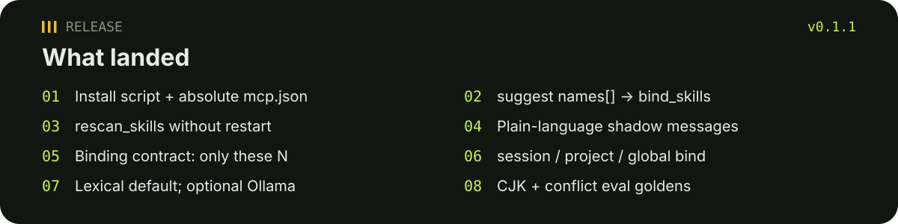

# skill-mcp

<p align="center">
  
</p>

<p align="center"><a href="./README.zh-CN.md">中文</a> · <a href="https://github.com/tsumon/skill-mcp/releases/tag/v0.1.1">v0.1.1 Release</a></p>

Local **stdio MCP** server that helps an agent pick which local `SKILL.md` files to use — and keeps the context small.

Replacement for the deleted `skillbind` CLI: MCP-only, no host adapters, no marketplace.

<p align="center">
  
</p>

## Release v0.1.1

<p align="center">
  
</p>

Notes: [GitHub Release v0.1.1](https://github.com/tsumon/skill-mcp/releases/tag/v0.1.1). This README is part of that release.

## Why the cap is hard

- **Max 3** bound skills. A larger token budget never raises that cap.
- Default budget is **4000** tokens (CJK-aware: Han, Hiragana, Katakana, Hangul). Budget can only drop more candidates.
- Lean by default: `name` / `description` / `path`. Full `SKILL.md` body is opt-in via `read_skill`.
- Default roots: `~/.claude/skills`, `~/.agents/skills`, `~/.codex/skills`, `~/.config/opencode/skills`.

## Install

Requires **Node 20+**. The one-shot script builds the server and writes **absolute-path** MCP snippets:

```bash
git clone https://github.com/tsumon/skill-mcp.git
cd skill-mcp
./scripts/install.sh
```

`./scripts/install.sh` runs `npm install`, `npm run build`, then `node dist/install-cli.js`. It writes:

- `docs/output/claude-desktop.mcp.json`
- `docs/output/cursor.mcp.json`

Those files use an **absolute** `args` path to `dist/index.js` on this machine. Copy them into the host config (or let the installer merge them). Restart Claude Desktop / Cursor.

<p align="center">
  
</p>

Manual build if you skip the script:

```bash
npm install
npm run build
npm test
node dist/index.js
```

## Claude Desktop

After `./scripts/install.sh`, copy `docs/output/claude-desktop.mcp.json` (absolute paths) into the Claude Desktop MCP config (often `claude_desktop_config.json`). Shape:

```json
{
  "mcpServers": {
    "skill-mcp": {
      "command": "/usr/bin/node",
      "args": ["/absolute/path/to/skill-mcp/dist/index.js"]
    }
  }
}
```

Do not paste a relative `./dist/index.js`. Use the generated file, or replace the args entry with the absolute path printed by the installer.

Optional env vars:

- `SKILL_MCP_ROOTS` — comma-separated user roots (overrides defaults). Colon and semicolon also work; prefer commas on Windows.
- `SKILL_MCP_PROJECT_ROOTS` / `SKILL_MCP_PLUGIN_ROOTS` — extra roots with project / plugin shadowing tiers
- `SKILL_MCP_STATE_DIR` — global binding directory (default `~/.config/skill-mcp`)
- `SKILL_MCP_PROJECT_DIR` — project bind root (default cwd); state at `<project>/.skill-mcp/binding.json`
- `SKILL_MCP_SESSION_ID` — in-memory session bind key
- `SKILL_MCP_EMBEDDINGS` — `auto` (default) / `on` / `off`. Ollama is a soft dependency.
- `SKILL_MCP_OLLAMA_URL` — embedding endpoint (default `http://127.0.0.1:11434` when probing)

## Cursor

Same generated snippet: `docs/output/cursor.mcp.json`. Shape:

```json
{
  "mcpServers": {
    "skill-mcp": {
      "command": "/usr/bin/node",
      "args": ["/absolute/path/to/skill-mcp/dist/index.js"]
    }
  }
}
```

## Core tools

### `list_skills`

Catalog `SKILL.md` files from configured roots. Each row is lean (`name`, `description`, `path`, `tokens`). Duplicate names are **shadowed** (project beats user beats plugin; then shorter path). Shadowed rows include a plain-language `shadow_message` (who shadows it and why) and `unshadow_hint` (archive/rename the winner, then `rescan_skills`).

### `suggest_skills`

Lexically rank skills for a prompt (optional Ollama embeddings). Returns at most **3**. Then applies the token budget (default 4000). `names` is ready for `bind_skills`. `next_step` tells the host to call bind with those names. `dropped[].why` is `cap`, `budget`, or `threshold`.

```json
{
  "prompt": "fix login redirect"
}
```

Pass `budget` to change the token limit. It still cannot return more than 3.

### `bind_skills`

Persist a lean binding (or clear it). More than 3 names is an error. Optional `scope`: `session` (in-memory), `project` (`<project>/.skill-mcp/binding.json`), `global` (`~/.config/skill-mcp/binding.json`, default).

```json
{ "names": ["login-fix", "alpha"] }
```

```json
{ "clear": true, "scope": "session" }
```

Priority when reading: **session > project > global**. Scopes do not overwrite each other.

## Other tools

| Tool | Purpose |
| --- | --- |
| `get_binding` | Resolved lean binding + `contract` (“only these N skills”) + per-scope snapshot. Pass `scope` to inspect one layer. |
| `why` | Why those skills are bound |
| `rescan_skills` | Reload skill roots without restarting the MCP process |
| `estimate_tokens` | Per skill or list (`body` or `description`) |
| `read_skill` | Explicit full `SKILL.md` body |
| `doctor` | Dry-run: roots, counts, binding path |
| `archive_idle` | Dry-run: idle candidates only |

MCP resource `skill-mcp://binding/contract` is the same contract text as `get_binding`.

`doctor` and `archive_idle` never create, move, or delete skill files.

## Binding contract

After bind, `get_binding` includes a host/model contract: use **only** the currently bound N skills, listed by name. Empty binding says not to load any `SKILL.md` until the user binds.

## Optional embeddings

Default routing is lexical (keyword / CJK n-grams). Set `SKILL_MCP_EMBEDDINGS=on` and an Ollama-compatible endpoint to upgrade. If Ollama is missing, suggest still works and reports `router: "lexical"`. There is no hard dependency and no fatal error.

## Eval

Offline goldens (ZH / JA / KO plus multi-skill conflicts):

```bash
npm run eval
```

Cases live in `eval/goldens.json`. Wired into `npm test`.

## Invariants

- Max 3 bound skills; budget never raises the cap
- Not a marketplace; no auto-uninstall; no ranker retrain
- Lean list / suggest / bind — no full bodies by default
- Local stdio MCP only

## License

MIT

中文说明见 [README.zh-CN.md](./README.zh-CN.md).
