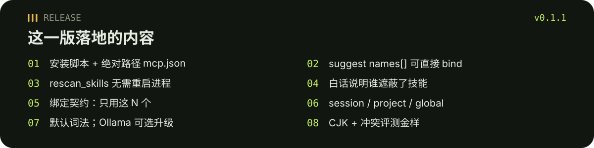
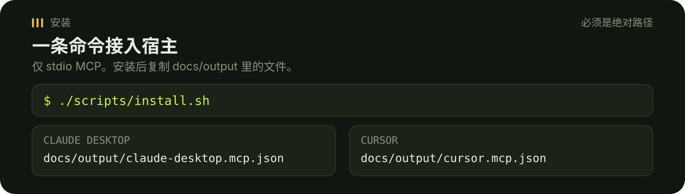

# skill-mcp

<p align="center">
  
</p>

<p align="center"><a href="./README.md">English</a> · <a href="https://github.com/tsumon/skill-mcp/releases/tag/v0.1.1">v0.1.1 Release</a></p>

本地 **stdio MCP 服务**：帮 agent 挑选要用的本地 `SKILL.md`，并控制上下文体积。

替代已删除的 `skillbind` CLI：仅 MCP，无 host adapter，非 marketplace。

<p align="center">
  
</p>

## Release v0.1.1

<p align="center">
  
</p>

发布说明：[GitHub Release v0.1.1](https://github.com/tsumon/skill-mcp/releases/tag/v0.1.1)。本 README 是该 Release 的一部分。

## 为什么 cap 是硬的

- 最多绑定 **3** 个 skill。更大的 token 预算也**不会提高**这个 cap。
- 默认预算 **4000** token（CJK 友好：汉字、平假名、片假名、韩文）。预算只能再丢掉候选项。
- 默认精简：只返回 `name` / `description` / `path`。完整正文用 `read_skill` 显式读取。
- 默认根目录：`~/.claude/skills`、`~/.agents/skills`、`~/.codex/skills`、`~/.config/opencode/skills`。

## 安装

需要 **Node 20+**。一条脚本即可构建服务并写出**绝对路径** MCP 片段：

```bash
git clone https://github.com/tsumon/skill-mcp.git
cd skill-mcp
./scripts/install.sh
```

`./scripts/install.sh` 会执行 `npm install`、`npm run build`，然后运行 `node dist/install-cli.js`，写出：

- `docs/output/claude-desktop.mcp.json`
- `docs/output/cursor.mcp.json`

这些文件里的 `args` 是本机 `dist/index.js` 的**绝对路径**。把它们拷进宿主配置（或让安装器合并），然后重启 Claude Desktop / Cursor。

<p align="center">
  
</p>

如果不用脚本，手动构建：

```bash
npm install
npm run build
npm test
node dist/index.js
```

## Claude Desktop

运行 `./scripts/install.sh` 后，把 `docs/output/claude-desktop.mcp.json`（绝对路径）写入 Claude Desktop 的 MCP 配置（常称 `claude_desktop_config.json`）。形状如下：

```json
{
  "mcpServers": {
    "skill-mcp": {
      "command": "/usr/bin/node",
      "args": ["/absolute/path/to/skill-mcp/dist/index.js"]
    }
  }
}
```

不要写相对路径 `./dist/index.js`。请使用生成的文件，或把 `args` 换成安装器打印的绝对路径。

可选环境变量：

- `SKILL_MCP_ROOTS` — 逗号分隔的用户根目录（覆盖默认值）。冒号和分号也可以；Windows 请优先用逗号。
- `SKILL_MCP_PROJECT_ROOTS` / `SKILL_MCP_PLUGIN_ROOTS` — 额外的 project / plugin 根目录（用于遮蔽优先级）
- `SKILL_MCP_STATE_DIR` — 全局绑定目录（默认 `~/.config/skill-mcp`）
- `SKILL_MCP_PROJECT_DIR` — 项目绑定根（默认当前目录）；状态在 `<project>/.skill-mcp/binding.json`
- `SKILL_MCP_SESSION_ID` — 内存中的 session 绑定键
- `SKILL_MCP_EMBEDDINGS` — `auto`（默认）/ `on` / `off`。Ollama 是软依赖。
- `SKILL_MCP_OLLAMA_URL` — 向量接口（探测时默认 `http://127.0.0.1:11434`）

## Cursor

同样使用生成的 `docs/output/cursor.mcp.json`：

```json
{
  "mcpServers": {
    "skill-mcp": {
      "command": "/usr/bin/node",
      "args": ["/absolute/path/to/skill-mcp/dist/index.js"]
    }
  }
}
```

## 核心工具

### `list_skills`

从配置的根目录列出 `SKILL.md`。每条都是精简视图（`name`、`description`、`path`、`tokens`）。同名项会被**遮蔽**（project 优先于 user 优先于 plugin，然后比路径长短）。被遮蔽项带白话 `shadow_message`（谁遮蔽了它、为什么）和 `unshadow_hint`（归档/重命名胜出项，然后调用 `rescan_skills`）。

### `suggest_skills`

按 prompt 对 skill 做词法排序（可选 Ollama 向量）。最多返回 **3** 个，然后再套用 token 预算（默认 4000）。`names` 可直接交给 `bind_skills`。`next_step` 会提示宿主用这些 names 调用 bind。`dropped[].why` 为 `cap`、`budget` 或 `threshold`。

```json
{
  "prompt": "fix login redirect"
}
```

可用 `budget` 改 token 上限，仍然不会返回超过 3 个。

### `bind_skills`

写入精简绑定（或清空）。超过 3 个名称会报错。可选 `scope`：`session`（内存）、`project`（`<project>/.skill-mcp/binding.json`）、`global`（`~/.config/skill-mcp/binding.json`，默认）。

```json
{ "names": ["login-fix", "alpha"] }
```

```json
{ "clear": true, "scope": "session" }
```

读取优先级：**session > project > global**。各层不会互相覆盖文件。

## 其他工具

| 工具 | 作用 |
| --- | --- |
| `get_binding` | 解析后的精简绑定 + `contract`（「只用这 N 个 skill」）+ 各 scope 快照。传 `scope` 可查看单层。 |
| `why` | 解释为何绑定这些 skill |
| `rescan_skills` | 重新扫描根目录，无需重启 MCP 进程 |
| `estimate_tokens` | 估算 token（`body` 或 `description`） |
| `read_skill` | 显式读取完整 `SKILL.md` 正文 |
| `doctor` | dry-run：检查根目录、数量、绑定路径 |
| `archive_idle` | dry-run：仅列出闲置候选 |

MCP resource `skill-mcp://binding/contract` 与 `get_binding` 的契约文本相同。

`doctor` 和 `archive_idle` 不会创建、移动或删除 skill 文件。

## 绑定契约

绑定之后，`get_binding` 会带上宿主/模型契约：只能使用当前绑定的 N 个 skill（按名称列出）。空绑定则要求在用户绑定之前不要加载任何 `SKILL.md`。

## 可选向量路由

默认是词法路由（关键词 / CJK n-gram）。设置 `SKILL_MCP_EMBEDDINGS=on` 并提供 Ollama 兼容接口可升级。没有 Ollama 时 suggest 仍然可用，并报告 `router: "lexical"`。软依赖，不会因此致命退出。

## 评测

离线金样（中/日/韩 + 多 skill 冲突）：

```bash
npm run eval
```

用例在 `eval/goldens.json`，并接入 `npm test`。

## 不变量

- 最多 3 个绑定；预算不会提高 cap
- 非 marketplace；不自动卸载；不重训 ranker
- 默认精简的 list / suggest / bind，不粘贴全文
- 仅本地 stdio MCP

## License

MIT

English: [README.md](./README.md).
