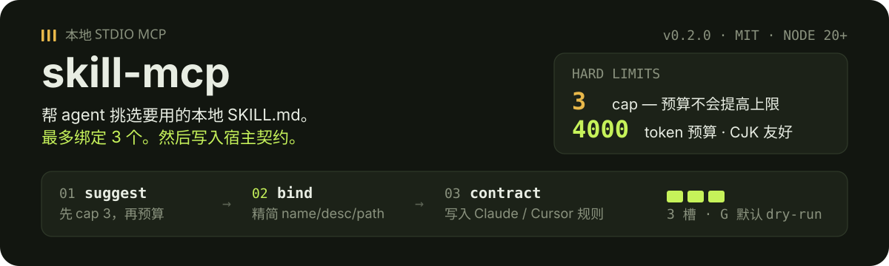
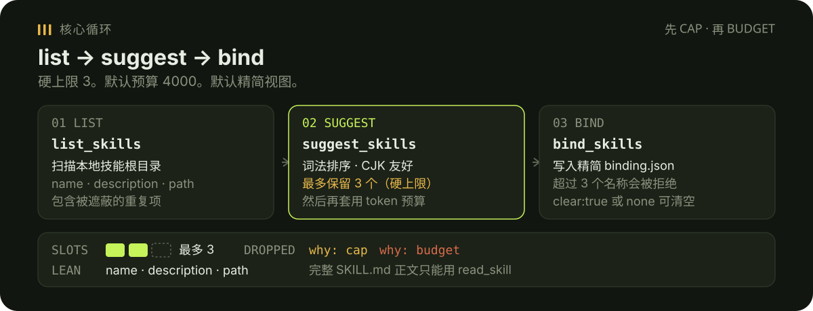

# skill-mcp

<p align="center">
  
</p>

<p align="center"><a href="./README.md">English</a></p>

本地 **stdio MCP 服务**：帮 agent 挑选要用的本地 `SKILL.md`，并控制上下文体积。

替代已删除的 `skillbind` CLI：仅 MCP，无 host adapter，非 marketplace。

<p align="center">
  
</p>

## 为什么 cap 是硬的

- 最多绑定 **3** 个 skill。更大的 token 预算也**不会提高**这个 cap。
- 默认预算 **4000** token（CJK 友好：汉字、平假名、片假名、韩文）。预算只能再丢掉候选项。
- 默认精简：只返回 `name` / `description` / `path`。完整正文用 `read_skill` 显式读取。
- 默认根目录：`~/.claude/skills`、`~/.agents/skills`、`~/.codex/skills`、`~/.config/opencode/skills`。

## 安装

需要 **Node 20+**。

```bash
git clone https://github.com/tsumon/skill-mcp.git
cd skill-mcp
npm install
npm run build
npm test
```

服务通过 stdio 讲 MCP：

```bash
node dist/index.js
```

## Claude Desktop

写入 Claude Desktop 的 MCP 配置（常称 `mcp.json`）：

```json
{
  "mcpServers": {
    "skill-mcp": {
      "command": "node",
      "args": ["/absolute/path/to/skill-mcp/dist/index.js"]
    }
  }
}
```

可选环境变量：

- `SKILL_MCP_ROOTS` — 逗号分隔的根目录（覆盖默认值）。冒号和分号也可以；Windows 请优先用逗号。
- `SKILL_MCP_STATE_DIR` — 绑定状态目录（默认 `~/.config/skill-mcp`）

## Cursor

在 Cursor MCP 设置中使用相同的 command / args：

```json
{
  "mcpServers": {
    "skill-mcp": {
      "command": "node",
      "args": ["/absolute/path/to/skill-mcp/dist/index.js"]
    }
  }
}
```

## 核心工具

### `list_skills`

从配置的根目录列出 `SKILL.md`。每条都是精简视图（`name`、`description`、`path`、`tokens`）。同名项会被**遮蔽**（project 优先于 user 优先于 plugin，然后比路径长短）。被遮蔽项带 `shadow_why` 和 `unshadow_hint`。

### `suggest_skills`

按 prompt 对 skill 做词法排序。最多返回 **3** 个，然后再套用 token 预算（默认 4000）。`dropped[].why` 为 `cap`、`budget` 或 `threshold`。

```json
{
  "prompt": "fix login redirect"
}
```

可用 `budget` 改 token 上限，仍然不会返回超过 3 个。

### `bind_skills`

写入精简绑定（或清空）。超过 3 个名称会报错。

```json
{ "names": ["login-fix", "alpha"] }
```

```json
{ "clear": true }
```

`none` 同样清空。状态默认写在 `~/.config/skill-mcp/binding.json`，可用 `SKILL_MCP_STATE_DIR` 覆盖。

## 其他工具

| 工具 | 作用 |
| --- | --- |
| `get_binding` | 当前精简绑定 |
| `why` | 解释为何绑定这些 skill |
| `estimate_tokens` | 估算 token（`body` 或 `description`） |
| `read_skill` | 显式读取完整 `SKILL.md` 正文 |
| `doctor` | dry-run：检查根目录、数量、绑定路径 |
| `archive_idle` | dry-run：仅列出闲置候选 |

`doctor` 和 `archive_idle` 不会创建、移动或删除 skill 文件。

## 不变量

- 最多 3 个绑定；预算不会提高 cap
- 非 marketplace；不自动卸载；不重训 ranker
- 默认精简的 list / suggest / bind，不粘贴全文

## License

MIT

English: [README.md](./README.md).
