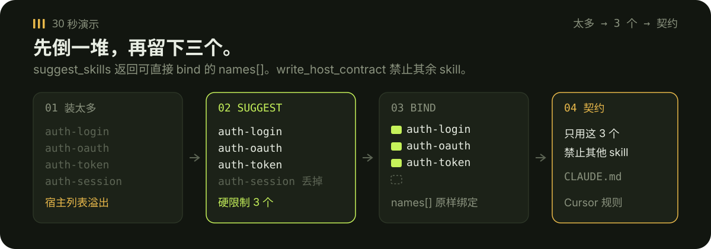
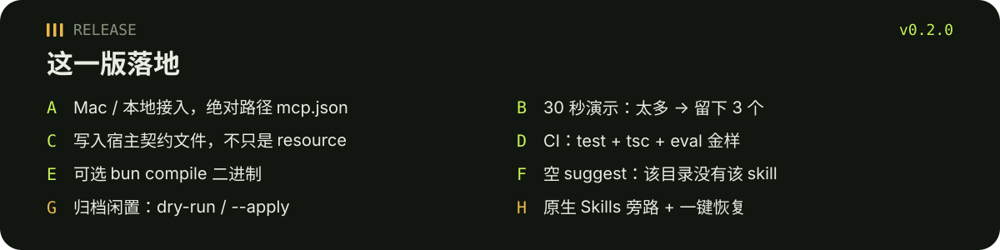
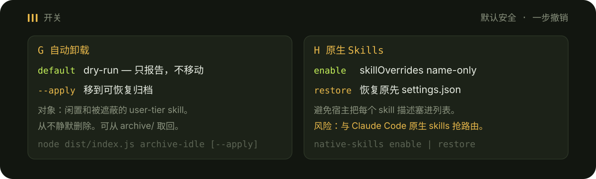

# skill-mcp

<p align="center">
  
</p>

<p align="center"><a href="./README.md">English</a> · <a href="https://github.com/tsumon/skill-mcp/releases/tag/v0.2.0">v0.2.0 Release</a></p>

本地 **stdio MCP 服务**：帮 agent 挑选要用的本地 `SKILL.md`，并控制上下文体积。

替代已删除的 `skillbind` CLI：仅 MCP，无 host adapter，非 marketplace。

## 30 秒演示

<p align="center">
  
</p>

1. 往 `~/.claude/skills`（或其它配置的根目录）丢进超过 3 个 `SKILL.md`。
2. 用 prompt 调用 `suggest_skills`。最多返回 **3** 个可直接 bind 的 `names[]`。没有匹配时：`This directory has no matching skill for that prompt.` / `该目录下没有匹配该提示的技能。`
3. 用这些 names 调用 `bind_skills`（硬限制 3 个）。
4. 调用 `write_host_contract`。Claude 的 `CLAUDE.md` 和 Cursor 的 `.cursor/rules` 只会列出**当前绑定**的 skill，并禁止其余。

```json
{ "prompt": "fix login redirect" }
```

```json
{ "names": ["auth-login", "auth-oauth", "auth-token"] }
```

## Release v0.2.0

<p align="center">
  
</p>

发布说明：[GitHub Release v0.2.0](https://github.com/tsumon/skill-mcp/releases/tag/v0.2.0)。本 README 是该 Release 的一部分。

## 为什么 cap 是硬的

- 最多绑定 **3** 个 skill。更大的 token 预算也**不会提高**这个 cap。
- 默认预算 **4000** token（CJK 友好：汉字、平假名、片假名、韩文）。预算只能再丢掉候选项。
- 默认精简：只返回 `name` / `description` / `path`。完整正文用 `read_skill` 显式读取。
- 默认根目录：`~/.claude/skills`、`~/.agents/skills`、`~/.codex/skills`、`~/.config/opencode/skills`。

<p align="center">
  
</p>

## 安装（Mac / 本地接入）

需要 **Node 20+**。一条脚本即可构建服务并写出**绝对路径** MCP 片段，并在可写时合并进 Claude Desktop / Cursor 配置：

```bash
git clone https://github.com/tsumon/skill-mcp.git
cd skill-mcp
./scripts/install.sh
```

`./scripts/install.sh` 会执行 `npm install`、`npm run build`，然后运行 `node dist/install-cli.js`，写出：

- `docs/output/claude-desktop.mcp.json`
- `docs/output/cursor.mcp.json`

这些文件里的 `args` 是本机 `dist/index.js` 的**绝对路径**。然后重启 Claude Desktop / Cursor。

Mac Claude Desktop：`~/Library/Application Support/Claude/claude_desktop_config.json`  
Linux：`~/.config/Claude/claude_desktop_config.json`  
Cursor：`~/.cursor/mcp.json`

<p align="center">
  
</p>

不要写相对路径 `./dist/index.js`。请使用生成的文件，或把 `args` 换成安装器打印的绝对路径。

可选环境变量：

- `SKILL_MCP_ROOTS` — 逗号分隔的用户根目录（覆盖默认值）
- `SKILL_MCP_PROJECT_ROOTS` / `SKILL_MCP_PLUGIN_ROOTS` — 额外的 project / plugin 根目录
- `SKILL_MCP_STATE_DIR` — 全局绑定目录（默认 `~/.config/skill-mcp`）
- `SKILL_MCP_PROJECT_DIR` — 项目绑定根（默认当前目录）
- `SKILL_MCP_SESSION_ID` — 内存中的 session 绑定键
- `SKILL_MCP_EMBEDDINGS` — `auto`（默认）/ `on` / `off`。Ollama 是软依赖。

可选单文件二进制（bun compile）：

```bash
./scripts/pack.sh
# dist-pack/skill-mcp  — 把宿主 args 指到这个绝对路径
```

没有 bun 时回退：`npm run build && node dist/index.js`。详见 [docs/PACKAGING.md](./docs/PACKAGING.md)。

## 宿主契约（真正生效）

`get_binding` 仍返回 `contract` 字符串，MCP resource `skill-mcp://binding/contract` 是同一段文本。v0.2.0 还会**一键写入宿主文件**，让 Claude Code 和 Cursor 真正加载：

```bash
node dist/index.js write-contract
# 或 MCP 工具 write_host_contract
```

写出：

- `<stateDir>/HOST-CONTRACT.md`（权威副本）
- `<project>/CLAUDE.md`（受管 `skill-mcp-contract` 块）
- `<project>/.cursor/rules/skill-mcp-contract.mdc`（`alwaysApply: true`）

生成文件**只列出当前绑定的 skill**，并禁止加载任何其他 `SKILL.md`。空绑定：在用户绑定之前不要加载任何 skill。

## 空的 suggest

prompt 没有任何匹配时，`suggest_skills` 设 `none: true`，并返回：

- `empty_message`：`This directory has no matching skill for that prompt.`
- `empty_message_zh`：`该目录下没有匹配该提示的技能。`

不会编造 names 去 bind。

## G — 自动卸载（dry-run / `--apply`）

<p align="center">
  
</p>

对象是**闲置**的 user-tier skill（不在当前绑定里）以及被**遮蔽**的 user-tier 副本。

| 模式 | 行为 |
| --- | --- |
| 默认 / MCP 不传 `apply` | Dry-run。只报告候选。**不移动、不删除。** |
| `--apply` 或 `apply: true` | 把每个候选移到 `~/.config/skill-mcp/archive/<timestamp>/`，并写 `manifest.json`。原路径不再存在；归档副本是恢复路径。 |

```bash
node dist/index.js archive-idle
node dist/index.js archive-idle --apply
```

MCP：`archive_idle` 不带参数是 dry-run；`{ "apply": true }` 才会归档。

从不静默删除。已绑定的 skill 不动。project-tier 不动。恢复方法：从 `archive/` 拷回。

## H — 原生 Skills 旁路（开关 / 恢复 / 风险）

Claude Code 否则会把每个本地 skill 的**描述**塞进列表。可选旁路往 `~/.claude/settings.json` 写入 `skillOverrides: { "<name>": "name-only" }`，列表里只留名字、丢掉描述。然后由 skill-mcp 做 suggest / bind / read。

| 命令 | 效果 |
| --- | --- |
| `native-skills enable` 或 `{ "enabled": true }` | 备份当前 settings，写入 name-only 覆盖 |
| `native-skills restore` 或 `{ "enabled": false }` | **一步**恢复备份 |

```bash
node dist/index.js native-skills enable
node dist/index.js native-skills restore
```

**风险：** 这是在和 Claude Code 原生 skills 抢路由。name-only 只是对模型隐藏描述，并不会删除 `SKILL.md`。plugin skill 不受 `skillOverrides` 影响。路由不对时立刻 restore。skill-mcp 不会在你未调用 enable 时改这个设置。

## 核心工具

### `list_skills`

从配置的根目录列出 `SKILL.md`。同名项会被**遮蔽**（project 优先于 user 优先于 plugin）。被遮蔽项带白话 `shadow_message`。

### `suggest_skills`

按 prompt 对 skill 做词法排序（可选 Ollama 向量）。最多返回 **3** 个。`names` 可直接交给 `bind_skills`。

### `bind_skills`

写入精简绑定。超过 3 个名称会报错。可选 `scope`：`session` / `project` / `global`（默认）。读取优先级：**session > project > global**。

## 其他工具

| 工具 | 作用 |
| --- | --- |
| `get_binding` | 解析后的精简绑定 + `contract` |
| `write_host_contract` | 注入 Claude + Cursor 规则文件 |
| `why` | 解释为何绑定这些 skill |
| `rescan_skills` | 重新扫描根目录，无需重启 |
| `estimate_tokens` | 估算 token（`body` 或 `description`） |
| `read_skill` | 显式读取完整 `SKILL.md` 正文 |
| `doctor` | dry-run：检查根目录、数量、绑定路径 |
| `archive_idle` | dry-run 闲置/被遮蔽的 user skill；`apply:true` 归档 |
| `native_skills_bypass` | `enabled:true` name-only；`enabled:false` 恢复 |

## 评测与 CI

离线金样（中/日/韩 + 多 skill 冲突）：

```bash
npm test
npx tsc --noEmit
npm run eval
```

`.github/workflows/ci.yml` 会在 pull request 和 `main` 上跑这些命令。

## 不变量

- 最多 3 个绑定；预算不会提高 cap
- 非 marketplace；不重训 ranker
- 默认精简的 list / suggest / bind，不粘贴全文
- 仅本地 stdio MCP
- G 从不静默删除；默认 dry-run
- H 可选，且可一步撤销

## License

MIT

English: [README.md](./README.md).
